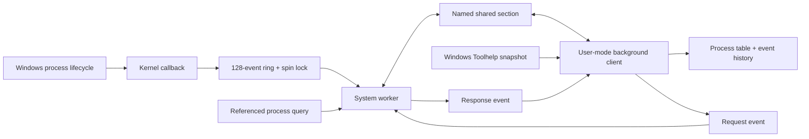

# Architecture and limits

## Request lifecycle

The section contains a 32-byte header, a 48-byte request and a 2,656-byte response, totalling 2,736 bytes. The allocation is one page. `shared/protocol.h` asserts sizes at compilation so the driver and frontend cannot silently disagree about structure packing. Neither requests nor responses contain addresses to dereference.

The cooperative client holds a named session mutex on its background thread. It copies a request, publishes `submitted` with an Interlocked operation and signals the request event. The worker claims `processing`, copies the request once, validates it, executes a read-only command and publishes a response before setting `complete` and signalling the response event. The client verifies the ID, epoch, sizes and payload length, then returns the slot to `idle`. It treats a negative NTSTATUS as an operation failure, separately from a lost connection.

Interlocked publication supplies the ordering for the cooperative producer/consumer contract. The mapped section remains writable by elevated clients; this is not a hostile-admin security boundary. An administrator can corrupt the slot or signal events out of order. Validation bounds commands and returned data, while avoiding any client-supplied memory-access pointer. The mutex prevents accidental concurrency between compliant clients, not deliberate interference.

The worker maps and unmaps the section in the same System-process context. It blocks at PASSIVE_LEVEL, with a one-second fallback wait so the stop flag remains observable. Driver unload sets the stop flag, signals the request event and waits for thread termination before releasing its handles. Callback removal waits for in-flight notifications, as specified by [PsSetCreateProcessNotifyRoutineEx](https://learn.microsoft.com/windows-hardware/drivers/ddi/ntddk/nf-ntddk-pssetcreateprocessnotifyroutineex). `/INTEGRITYCHECK` sets the image flag required by this callback API; signing is a separate deployment requirement.

## Event buffering

Notifications copy a timestamp, PID, parent PID and bounded UTF-16 image string into a stack record, then append under a spin lock. Exit events carry the PID and time; the callback does not provide creation-image data on exit. Only a fixed-size copy and counter update occur under the append lock. Reads copy at most 16 records under the same lock.

Sequence numbers are assigned while holding the lock. They order capture, rather than guaranteeing a globally causal ordering across simultaneous processes. Total create/exit counters survive ring overwrite. Readers provide their own sequence cursor; reads do not destroy records. If a cursor predates retained history, `dropped` reports precisely how many records were overwritten. A cursor beyond current history is rejected. A driver epoch prevents using a cursor from a previous load.

The GUI drains up to eight batches per refresh and keeps the most recent 1,000 displayed events. This bounds both kernel and frontend history. If event generation exceeds retention or polling capacity, loss is visible; this is not an audit log with durable storage.

## Deliberate limitations

- One request slot and one cooperative frontend; there is no multi-client dispatch.
- No persistent event storage, memory scanner, process modification or module dumper.
- Creation paths are limited to 63 UTF-16 code units and may be partial or unavailable; truncation is flagged.
- Creation records reflect callbacks, not an assurance that process creation ultimately succeeded. Another callback can reject creation; this driver never changes `CreationStatus`.
- Process names in the table come from Windows snapshots; callbacks report lifecycle events, not a complete initial enumeration.
- Process IDs can be reused. Queries are snapshots of the process owning a PID at lookup time; selection does not retain an identity handle across refreshes.
- The GUI reconnects approximately every three seconds, with a 1.5-second transport deadline. Closing during an in-flight query can wait for that deadline.
- An old frontend can retain named objects after unload. Close it before reloading the driver so those names are released. Startup deliberately rejects collisions.
- Callback unregistration is an invariant of the unload path. If it unexpectedly fails, the driver logs it and asserts in checked/debug builds; this needs VM verification.
- No signed release, INF installer or kernel runtime certification is supplied. The solution is x64 only.
